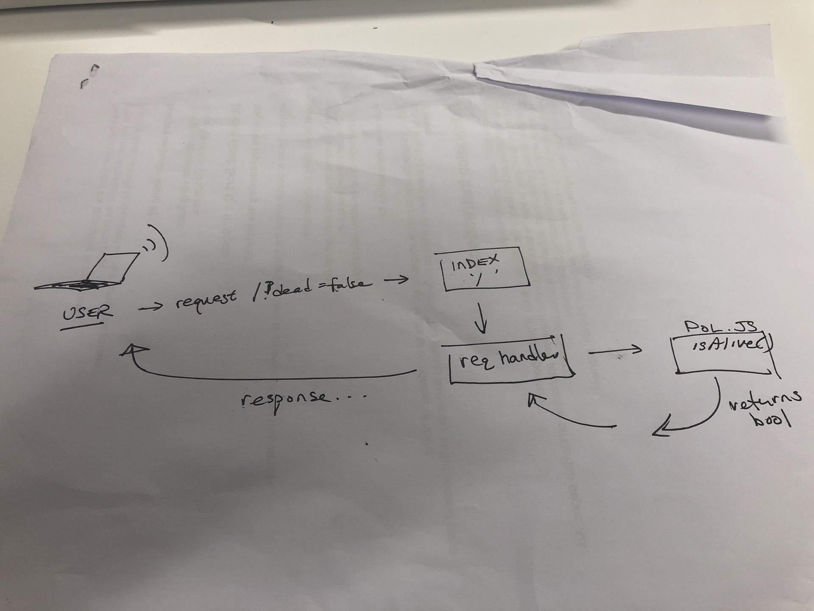

## Lab-00

## Project Name

### Author: Student/Group Name

### Links and Resources

- [submission PR] https://github.com/tyler-401-advanced-javascript/lab-00/pull/1
- [ci/cd] https://travis-ci.com/tyler-401-advanced-javascript/lab-00 (GitHub Actions)
- [front-end application] https://tylersayvetz-lab-00.herokuapp.com/ (when applicable)
- [docs] https://tylersayvetz-lab-00.herokuapp.com/docs/

### Setup

#### `.env` requirements (where applicable)

i.e.

- `PORT` - 3000 
- `MONGODB_URI` - URL to the running mongo instance/db

#### How to initialize/run your application (where applicable)

- e.g. `npm start`
- Endpoint: '/'
  - returns a boolean;
- Enpoint: '/docs'
  returns documentation pages.

 

#### Testing

- Done with 'npm test'
- Lint with 'npm run lint'

- How do you run tests?
- Any tests of note?
- Describe any tests that you did not complete, skipped, etc

Incomplete tests: 

- x ,y ,x;

#### UML

;
